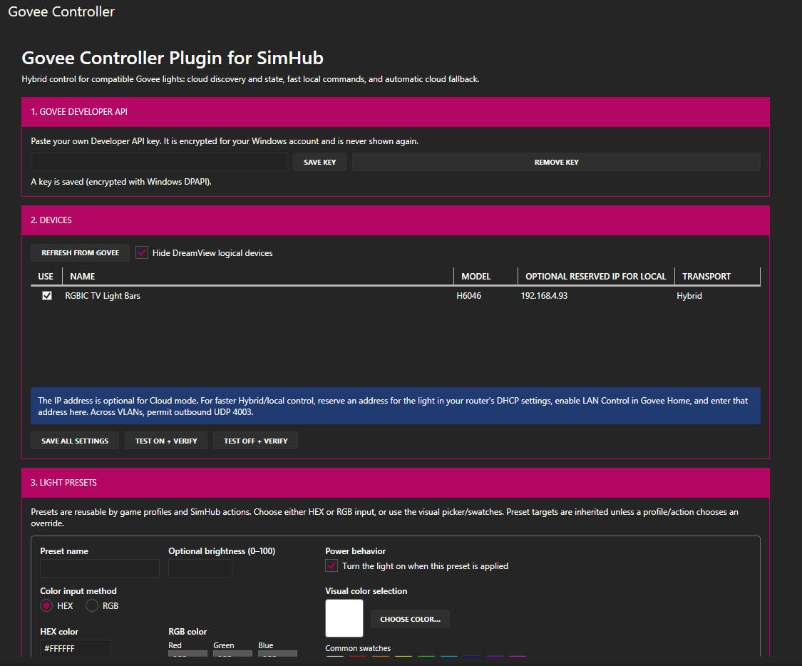
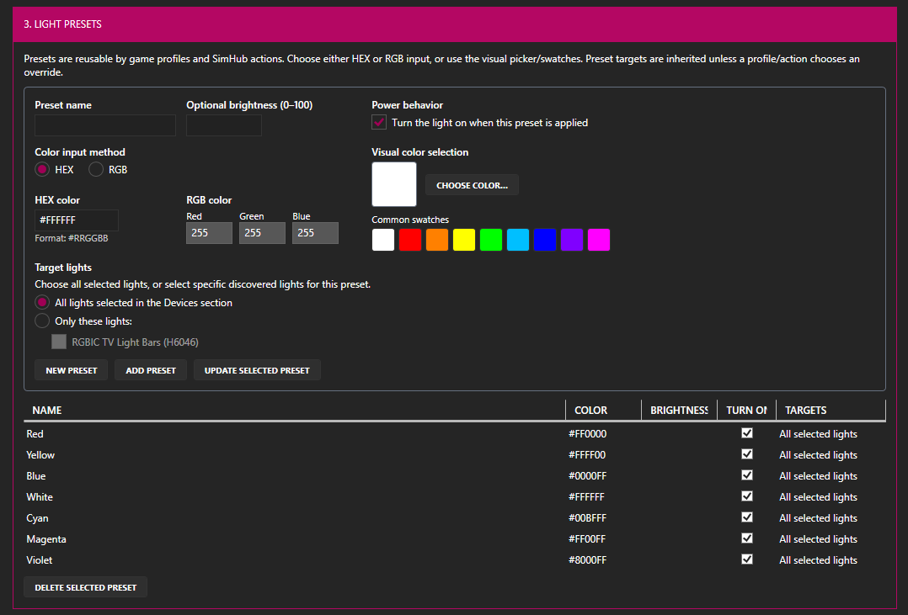
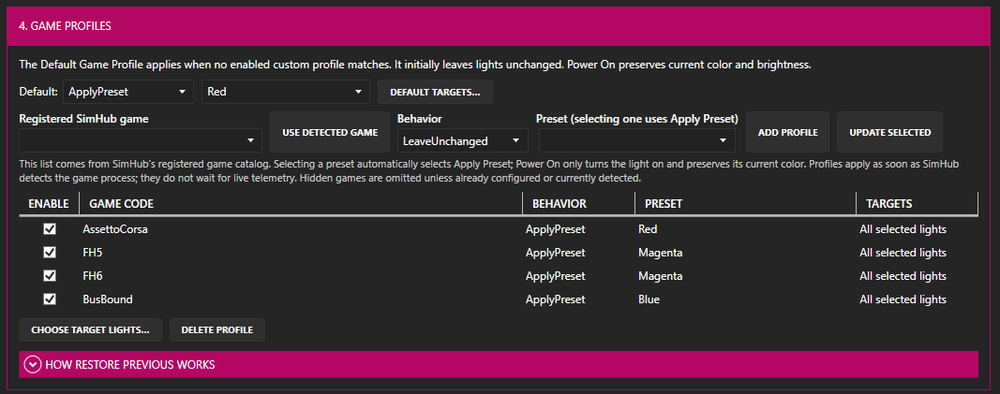
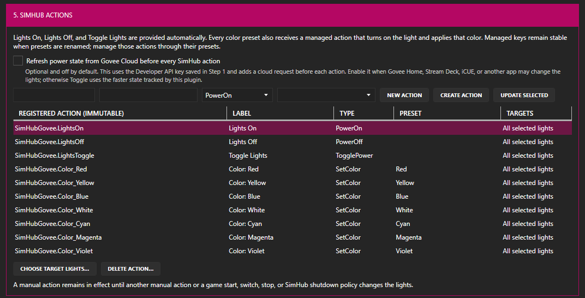
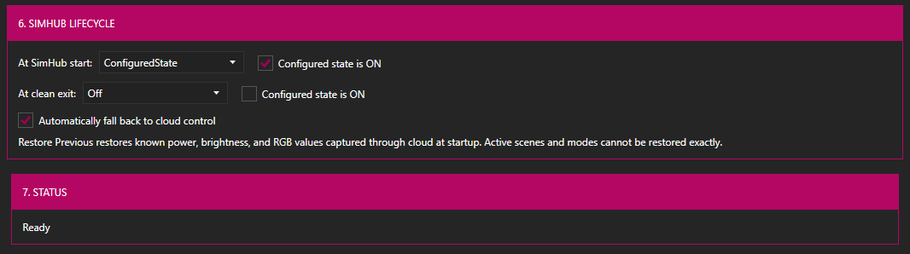

# Govee Controller Plugin for SimHub

<p align="center">
  
</p>

Govee Controller Plugin for SimHub is a Windows plugin for controlling compatible Govee room lights from SimHub. It appears as **Govee Controller** in SimHub's menu. The first verified device is the **H6046 RGBIC TV Light Bars**, but devices are discovered from Govee capability metadata rather than hard-coded by model.

> **This is not an ambient-lighting or screen-color-matching plugin.** SimHub already has a separate plugin for Govee ambient lighting. Govee Controller is intended for lights that are not supported by that ambient-lighting integration, as well as users who want direct control over the lighting in their room.

The goal is to put your room lights into a chosen default state when SimHub starts, automatically apply different settings when specific games start, restore their previous state when gameplay ends, and expose lighting actions to SimHub. Those actions can be assigned to button boxes, Dash Studio dashboard buttons, or other SimHub controls for manual power and color changes.

The included plugin icon is original project artwork and does not use Govee's logo or wordmark.

Version 0.2 adds reusable color/brightness presets, default and per-game profiles, targeted lights, pre-game restoration, and named SimHub actions for Dash Studio dashboards or button boxes. Managed On, Off, Toggle, and per-color actions are created automatically. It retains device discovery, verified power tests, configurable startup/exit behavior, encrypted credentials, and hybrid local/cloud control.

## Screenshots

### Setup and device selection



### Reusable light presets



### Per-game profiles



### SimHub and Dash Studio actions



### Lifecycle and status



## Architecture

```text
SimHub lifecycle / settings panel
              |
              v
       policy + controller
        /             \
UDP 4003 commands   Govee Developer API
(fast local path)   (discovery, state, fallback)
```

For a Hybrid device, routine power/brightness/color commands go directly to its reserved IPv4 address. Local UDP commands are fire-and-forget, so the explicit test buttons confirm their result using the eventually consistent cloud state endpoint. If a local send fails, the plugin can automatically use cloud control. Cloud-only and Local-only modes are also available per device.

The plugin never depends on Govee Desktop or its DLL. The supplied Desktop API GUID repeatedly failed with Govee error `1001`; it is not compiled into the plugin. The user supplies their own **Govee Developer API key**, which is encrypted with Windows DPAPI for the current user and never redisplayed.

## Requirements

- Windows and SimHub with .NET Framework 4.8
- A Govee Developer API key
- For fast local control: LAN Control enabled in the Govee Home mobile app
- A DHCP reservation/manual IPv4 address for each local target
- Network routing that permits the PC to send UDP 4003 to the light

The PC and light may be on different subnets. Multicast discovery is not required because cloud discovery supplies device identity and the user supplies the reserved local IP. Incoming UDP 4002 and its firewall rule are only needed by the research LAN discovery probe, not by the released plugin.

## Build and test

SimHub is expected at `C:\Program Files (x86)\SimHub`. Override that at build time with `SIMHUB_INSTALL_PATH` if necessary.

```powershell
.\scripts\build.ps1
```

Automated tests use fake cloud/LAN transports and do not change real lights. See [Testing](docs/TESTING.md) for the hardware release checklist.

## Install

Close SimHub, then copy `SimHub.Govee.dll` to the SimHub installation directory, normally `C:\Program Files (x86)\SimHub`. An elevated PowerShell can install a local release build with:

```powershell
.\scripts\install-development.ps1
```

Start SimHub, enable **Govee Controller Plugin for SimHub** in its Plugins settings, then:

1. Open **Govee Controller** and save your Developer API key.
2. Refresh devices and select the lights SimHub should control.
3. For Hybrid mode, enter each light's DHCP-reserved IPv4 address.
4. Save the choices and use the confirmed **Test ON/OFF + verify** controls.
5. Choose startup and clean-exit behavior.

## Presets and per-game behavior

Create reusable Light Presets using one color-entry method at a time: HEX, separate RGB fields, the Windows visual color picker, or common color swatches. Choosing a swatch supplies its friendly color name when the preset name is blank. Each preset also supports optional brightness, automatic power-on, and either all selected lights or specific discovered lights chosen by name. The Default Game Profile applies to every game without a custom profile and initially uses **Leave Unchanged**, making upgrades non-disruptive. Custom profiles are chosen from SimHub's registered game catalog (with current-game detection as a shortcut) and may leave lights unchanged, turn them on while preserving color/brightness, turn them off, or apply a preset.

When SimHub detects the first game process in a session, the matching profile applies immediately without waiting for live telemetry. The plugin uses SimHub's stable game code (such as `AssettoCorsa` or `FH6`) rather than its display name. Hybrid/Cloud devices have their known power, brightness, and RGB captured through cloud state. Switching games applies the new profile without losing that original snapshot. When gameplay ends, the original known state is restored. Local-only devices cannot report physical state; the plugin restores its last commanded state when available, otherwise it applies the global default as a documented best effort. Scenes, music modes, segmented effects, and DreamView cannot be recreated exactly.

## SimHub and Dash Studio actions

Create named actions in the plugin with one of these types:

- Power On
- Power Off
- Toggle Power
- Set Color, using a saved preset

Each action targets all selected lights or specific lights. It appears in SimHub under a stable name such as `SimHubGovee.RaceRed`, where it can be assigned in Controls and Events or triggered by a Dash Studio button. The permanent action key is immutable after creation so existing bindings survive later changes to its label, color preset, or targets. Deleting an action warns that its existing mappings will stop working.

`SimHubGovee.LightsOn`, `SimHubGovee.LightsOff`, and `SimHubGovee.LightsToggle` are managed defaults. Every preset receives a managed `Color_<name>` action that always turns on the target and applies its color. Renaming the preset updates the label without changing the immutable registered key; deleting the preset deletes its generated action after warning. Managed color actions inherit the preset's target selection.

Toggle uses the per-light power state tracked across startup, profiles, restores, and successful commands. If another application may change the lights, enable **Refresh power state from Govee Cloud before every SimHub action**. It is off by default, uses the Developer API key saved in Step 1, and adds a cloud request before each action. If refresh fails, the action continues using tracked state.

The internal DLL name, settings identity, and `SimHubGovee.*` registered action prefix intentionally remain unchanged for upgrade compatibility. This preserves existing settings and button bindings while the user-facing product name changes.

A manual action remains in effect until another manual action or a game start, switch, stop, or SimHub shutdown policy changes the desired state.

The default startup state is ON. The default clean-exit action is OFF. Other exit choices are Leave Unchanged, a configured ON/OFF state, or Restore Previous. Restore Previous captures and restores known power, brightness, and RGB state; the cloud API does not expose enough current-state data to reproduce an active scene or music/DreamView mode exactly. Exit handling is best-effort on a normal SimHub shutdown and cannot run after a crash, forced termination, or power loss.

## Privacy, limits, and troubleshooting

- The API key is stored only as a current-user DPAPI ciphertext in SimHub settings.
- Device names and IDs are not deliberately logged by the plugin.
- DreamView logical devices are hidden by default.
- The cloud API is rate-limited. Avoid repeatedly refreshing or hammering verified tests.
- If local commands fail, confirm LAN Control is still enabled, the IP reservation is current, and UDP 4003 is allowed between VLANs. Cloud-only mode can confirm whether the credential/device side is healthy.
- If the key is rejected, verify it is a Developer API key—not the Desktop OpenAPI GUID.

## Release package

```powershell
.\scripts\package-release.ps1 -Version 0.2.0
```

This produces a ZIP and SHA-256 checksum under `artifacts`. Govee Desktop binaries and user credentials are never packaged.

More detail is in the [architecture plan](docs/ARCHITECTURE.md). The original probes remain as research artifacts. Vendor-provided documentation is retained locally under `resources` but excluded from source and release distribution because redistribution rights were not granted.

## License

MIT. Govee and SimHub names and trademarks belong to their respective owners. This is an independent community integration.
